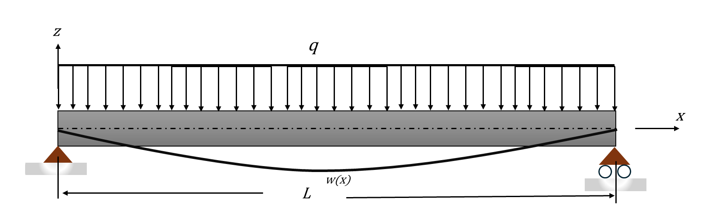
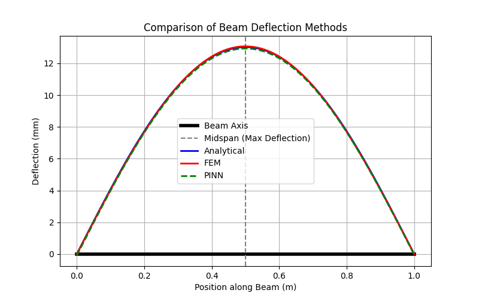

# Physics-Informed Neural Network (PINN) for Beam Deflection

This project implements a **Physics-Informed Neural Network (PINN)** to solve the **Euler-Bernoulli Beam Equation** for a simply supported beam under a uniformly distributed load. The PINN solution is compared with the **Finite Element Method (FEM)** and the **Direct Integration Method (Analytical Solution)**.

## Project Overview

This project aims to approximate the beam deflection under a given load using three different approaches:

1. **Direct Integration Method (Analytical Solution)**
2. **Finite Element Method (FEM)**
3. **Physics-Informed Neural Network (PINN)**

The PINN model is trained to minimize the residuals of the governing differential equation while satisfying the boundary conditions. The accuracy of the PINN solution is compared against analytical and FEM solutions.

## Problem Formulation
The beam deflection is governed by the **Euler-Bernoulli beam equation**:
Example beam taken for analysis is a simply supported beam loaded with uniformly distributed load.


$$
\frac{d^4 w}{dx^4} = \frac{q}{EI}
$$

where:
- **w(x)** is the beam deflection
- **q** is the uniformly distributed load (N/m)
- **E** is the Young’s modulus (Pa)
- **I** is the moment of inertia (m⁴)
- **L** is the beam length (m)

### Boundary Conditions
For a **simply supported beam**, the boundary conditions are:
- **Displacement at the supports**:  
  $$
  w(0) = 0, \quad w(L) = 0
  $$

- **Moment-free condition at the supports**:  
  $$
  \frac{d^2w}{dx^2} \Big|_{x=0} = 0, \quad \frac{d^2w}{dx^2} \Big|_{x=L} = 0
  $$
## Installation and Setup

### 1. Clone the Repository
```sh
git clone https://github.com/YOUR_GITHUB_USERNAME/PINN_Beam_Deflection.git
cd PINN_Beam_Deflection
```

### 2. Install Dependencies
```sh
pip install -r requirements.txt
```

### 3. Run the PINN Model
Train the Physics-Informed Neural Network (PINN):
```sh
python src/PINN_Method.py
```

### 4. Run the Comparison Analysis
Compare the PINN, FEM, and Analytical solutions:
```sh
python src/Analysis_and_Comparison.py
```

## Project Structure

```
PINN_Beam_Deflection/
│── src/                         # Source Code
│   ├── DirectIntegrationMethod.py  # Analytical Solution
│   ├── FiniteElementMethod.py      # FEM Solution
│   ├── PINN_Method.py              # PINN Model Training
│   ├── Analysis_and_Comparison.py  # Code to Compare All Methods
│── models/                      # Saved Model Files
│   ├── pinn_full_model.pth         # Saved PINN Model
│── results/                      # Output Data and Plots
│   ├── pinn_deflection.csv         # PINN Deflection Data
│   ├── training_loss.png           # Loss Plot
│   ├── deflection_plot.png         # Deflection Plot
│── README.md                    # Project Documentation
│── requirements.txt              # Dependencies
│── .gitignore                    # Ignore unnecessary files
│── LICENSE                       # License for Open-Source Sharing (Optional)
```

## Methods Used

### 1. Direct Integration (Analytical Solution)
- Solves the **Euler-Bernoulli equation** symbolically using integration.
- Provides an **exact reference solution** for validation.

### 2. Finite Element Method (FEM)
- Discretizes the beam into elements and applies numerical methods.
- Used in engineering applications for structural analysis.

### 3. Physics-Informed Neural Network (PINN)
- Uses **deep learning** to approximate the beam deflection.
- Encodes physical laws (**Euler-Bernoulli equation**) as part of the loss function.

## Results and Visualizations


### Beam Deflection Curve
This plot compares the deflection computed by **PINN, FEM, and the analytical solution**:



### Training Loss
The PINN training loss over epochs:


## References

- Raissi, M., Perdikaris, P., & Karniadakis, G. E. (2019).  
  *Physics-informed neural networks: A deep learning framework for solving forward and inverse problems involving nonlinear partial differential equations.*  
  **Journal of Computational Physics, 378**, 686-707.  
  [DOI: 10.1016/j.jcp.2018.10.045](https://doi.org/10.1016/j.jcp.2018.10.045)

- Baydin, A. G., Pearlmutter, B. A., Radul, A. A., & Siskind, J. M. (2018).  
  *Automatic Differentiation in Machine Learning: a Survey.*  
  **Journal of Machine Learning Research, 18**, 1-43.  
  [JMLR Paper](http://jmlr.org/papers/v18/17-468.html)

- Euler-Bernoulli Beam Theory  
  Covers fundamental derivations and equations related to beam deflection analysis.

- Finite Element Analysis for Beams  
  Discusses the **Finite Element Method (FEM)** approach for beam deflection problems.

---
This project provides an advanced **deep learning-based approach** to solving engineering physics problems using PINNs.
